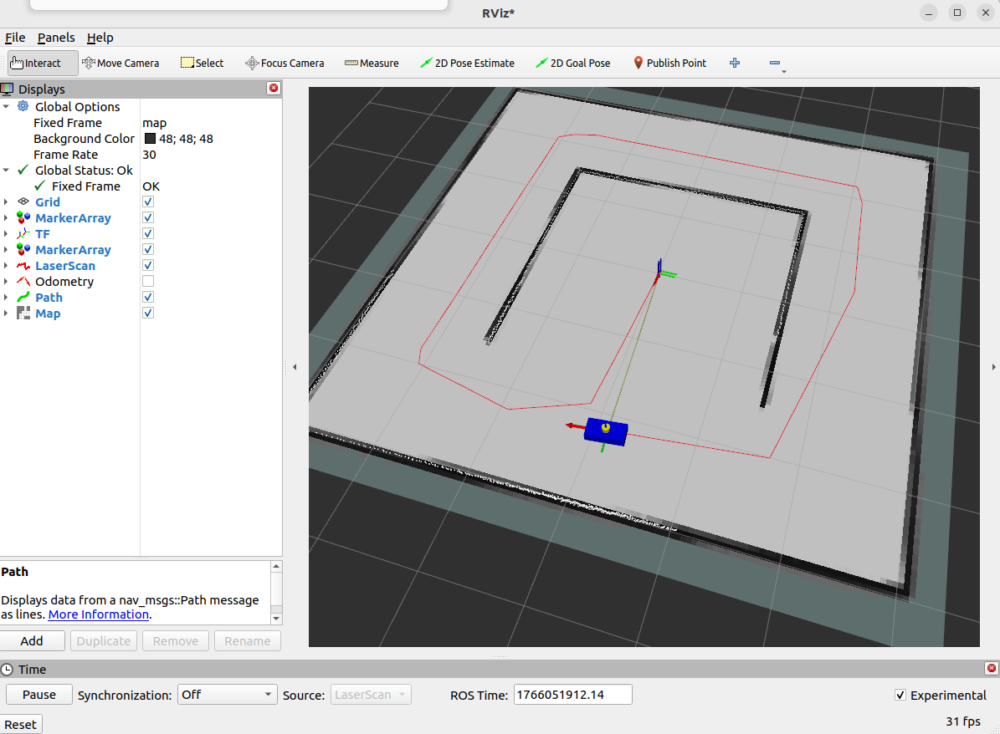

# jarabot-simulator-slam

A ROS 2 Humble–based Jarabot simulator with Cartographer SLAM integration.

## Author

**Yonguk Cho**  
Robotics Developer / ROS 2 Engineer  
Creator of Jarabot Simulator

---

This repository extends the original **Jarabot Simulator** by adding
**Cartographer SLAM**, enabling real-time map building and localization
using simulated LiDAR data.

It is designed for **ROS 2 SLAM education, simulation-based testing,
and algorithm development without real hardware**.

> Keywords: ROS2 Simulator, Mobile Robot Simulator, LiDAR, RViz2, Odometry, TF, SLAM, Navigation2, Cartographer

---

### Image of the actual JaraBot


### Image of the Jarabot simulator operating in RViz


### Image of the Jarabot simulator operating in RViz with Cartographer




## Features

- 2D differential-drive mobile robot simulator
- Simulated 2D LiDAR (`/scan`)
- Encoder-based odometry (`/odom`)
- TF tree broadcasting (`odom → base_link`)
- Cartographer SLAM integration
- RViz2 visualization
- Keyboard teleoperation
- Safety stop node for collision protection

---

## Requirements

- Ubuntu 22.04
- ROS 2 Humble
- RViz2

```bash
ros2 -h
echo $ROS_DISTRO   # should output: humble
```
---

## Workspace Structure

This repository follows the standard ROS 2 `colcon` workspace layout:

```text
jarabot_sim_ws
├── src
│   ├── jarabot_sim
│   ├── jarabot_sim_cartographer
│   ├── jarabot_sim_interfaces
│   ├── jarabot.png
│   ├── jarabot_sim_rviz.png
│   └── README.md
├── build
├── install
└── log
```

---

⚠️  build/, install/, and log/ directories are generated by colcon
and are not required to be pushed to GitHub.

## Packages Overview
### 1. jarabot_sim

- Core simulator package.
- LiDAR simulation
- Encoder & odometry
- TF publishing
- RViz marker & path visualization
- Safety stop node

### 2. jarabot_sim_cartographer

- Cartographer SLAM integration package.
- Cartographer configuration
- SLAM launch files
- Map generation in RViz

### 3. jarabot_sim_interfaces

Custom message definitions for Jarabot.

## Required Tools

These are needed to build and manage ROS workspaces.

```bash
sudo apt update
sudo apt install -y \
  git \
  python3-colcon-common-extensions \
  python3-rosdep \
  build-essential
```

## Required ROS 2 Packages (Simulator)

Required for simulation, TF handling, and RViz visualization.

```bash
sudo apt install -y \
  ros-humble-rviz2 \
  ros-humble-tf2-ros ros-humble-tf-transformations \
  ros-humble-robot-state-publisher \
  ros-humble-joint-state-publisher \
  ros-humble-nav-msgs \
  ros-humble-sensor-msgs \
  ros-humble-geometry-msgs \
  ros-humble-teleop-twist-keyboard
```

## Cartographer SLAM (Required for Mapping)

Used to generate a 2D map from simulated LiDAR data.

```bash
sudo apt install -y \
  ros-humble-cartographer \
  ros-humble-cartographer-ros
```

## Installation

```bash
mkdir -p ~/jarabot_sim_ws/src
cd ~/jarabot_sim_ws/src
git clone https://github.com/playros/jarabot-simulator-slam.git .
```

## Build

```bash
cd ~/jarabot_sim_ws
colcon build
source install/setup.bash
```

## Running the Simulator + SLAM

This project is designed to be run using 5 separate terminals.

### Terminal 1 – Jarabot Simulator

```bash
source ~/jarabot_sim_ws/install/setup.bash
ros2 launch jarabot_sim jarabot_simulator.launch.py
```

### Terminal 2 – Cartographer SLAM

```bash
source ~/jarabot_sim_ws/install/setup.bash
ros2 launch jarabot_sim_cartographer cartographer_slam.launch.py
```

### Terminal 3 – RViz2

```bash
source ~/jarabot_sim_ws/install/setup.bash
rviz2
```

### Terminal 4 – Keyboard Teleoperation

```bash
source ~/jarabot_sim_ws/install/setup.bash
ros2 run teleop_twist_keyboard teleop_twist_keyboard \
  --ros-args -r cmd_vel:=/cmd_vel_raw
```

### Terminal 5 – Safety Stop Node

```bash
source ~/jarabot_sim_ws/install/setup.bash
ros2 run jarabot_sim jarabot_sim_safety_stop
```
---

## Post-Launch Checklist (Quick Verification)

### Nodes are running

```bash
ros2 node list
```

Expected:

- jara_sim_* nodes (encoder, odometry, lidar, marker, path)
- cartographer_node
- cartographer_occupancy_grid_node

📌 If Cartographer nodes are missing, SLAM is not running.

### Required topics exist

```bash
ros2 topic list | grep -E "/cmd_vel|/scan|/odom|/map|/tf"
```

| Topic      | Purpose                |
| ---------- | ---------------------- |
| `/cmd_vel` | Robot velocity command |
| `/scan`    | Simulated LiDAR        |
| `/odom`    | Odometry               |
| `/map`     | SLAM-generated map     |
| `/tf`      | Coordinate transforms  |

### Topics are publishing data

```bash
ros2 topic hz /scan
ros2 topic hz /odom
ros2 topic hz /map
```
✔ If frequency is not zero, the system is working.

### TF tree is connected (MOST IMPORTANT)

```bash
ros2 run tf2_ros tf2_echo map base_link
```
Expected TF chain:
```bash
map → odom → base_link
```
📌 If this is broken, the map will not appear correctly in RViz.

### Robot movement test

```bash
ros2 topic pub --once /cmd_velros2 topic pub --once /cmd_vel_raw geometry_msgs/msg/Twist "{linear: {x: 0.2}, angular: {z: 0.0}}" geometry_msgs/msg/Twist \
"{linear: {x: 0.2}, angular: {z: 0.0}}"
```
✔ Robot moves
✔ Odometry changes
✔ Map updates in RViz

---

🧠 Summary

- This project provides a ROS 2 Humble–based 2D mobile robot simulator
- Includes virtual LiDAR, odometry, TF, and Cartographer SLAM
- Designed for education, SLAM testing, and algorithm development

```

## Keyboard Control (teleop_twist_keyboard)

| Key        | Action                    |
| ---------- | ------------------------- |
| `i`        | Move forward              |
| `,`        | Move backward             |
| `j`        | Rotate left               |
| `l`        | Rotate right              |
| `k`        | Stop                      |
| `q / z`    | Increase / decrease speed |
| `Ctrl + C` | Exit                      |

## Main Topics

| Topic          | Type                     | Description           |
| -------------- | ------------------------ | --------------------- |
| `/scan`        | `sensor_msgs/LaserScan`  | Simulated LiDAR       |
| `/odom`        | `nav_msgs/Odometry`      | Odometry              |
| `/tf`          | TF                       | Coordinate transforms |
| `/cmd_vel_raw` | `geometry_msgs/Twist`    | Raw velocity command  |
| `/map`         | `nav_msgs/OccupancyGrid` | SLAM-generated map    |

## Visualization

### RViz2 can be used to visualize:
- Robot model & markers
- LiDAR scan
- SLAM map
- Robot trajectory
- TF tree

---

### Use Cases

- ROS 2 SLAM education
- Cartographer configuration testing
- Navigation2 pre-integration testing
- Simulation-only robotics training

---

### License

MIT License

---

- Developed and maintained by **Yonguk Cho**
- **Jarabot Simulator** (also known as **jarabot-simulator** or **jarabot simulator**)


